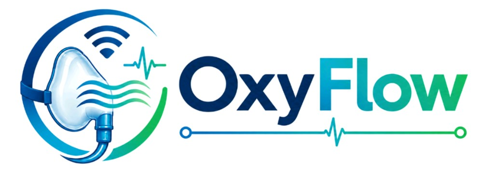

<div align="center">
  
  <h3>Monitor Every Breath. Protect Every Patient.</h3>
  <p>A modern, high-performance marketing homepage for the <strong>OxyFlow</strong> hospital oxygen monitoring system.</p>

  <div>
    
    
    
    
    
  </div>
</div>

---

## ✨ Features

- **Dynamic Hero Section**: Features a responsive 3D parallax tilt effect powered by Framer Motion.
- **Interactive Product Showcase**: Tap or hover over product hotspots to reveal detailed information tooltips.
- **Cascading Animations**: Staggered scroll-triggered animations to smoothly introduce content as users navigate the page.
- **Dark Mode Support**: Seamless integration with `next-themes` featuring a beautiful system-aware dark theme.
- **Scroll Progress & Floating Actions**: Interactive navigation with a scroll progress bar and a floating quick-action widget for immediate engagement.
- **Fully Responsive**: Optimized for flawless performance across mobile, tablet, and desktop devices.

## 🚀 Quick Start

Ensure you have Node.js installed, then follow these steps to run the development server locally:

```bash
# 1. Clone the repository
git clone https://github.com/dhruvesh7/OxyFlow-Product_Page.git

# 2. Navigate into the project directory
cd OxyFlow-Product_Page

# 3. Install dependencies
npm install

# 4. Start the development server
npm run dev
```

Open [http://127.0.0.1:43123](http://127.0.0.1:43123) in your browser to see the result.

## ⚙️ Configuration

All copy, pricing (₹2,500/device), and download links are centralized for easy management. Edit the `lib/constants.ts` file to update product information.

### Desktop App Setup
To link the desktop application installer:
1. Place your installer at `public/OxyFlow-Setup.exe` **or**
2. Set an external CDN URL in `lib/constants.ts`:
   ```ts
   export const PRODUCT = {
     desktopDownloadUrl: "https://your-cdn.com/OxyFlow-Setup.exe",
   };
   ```

## 🎨 Asset Management

Store your images in the `public/images/` directory. The application is configured to use the following files:

| File Path | Description / Usage |
|-----------|----------------------|
| `public/images/oxyflow-logo.png` | Main brand logo (Header, Footer, Hero) |
| `public/images/oxyflow-product.png` | Core product image (Hero, Showcase, Pricing) |
| `public/images/oxyflow-overview.svg` | Diagram/Overview image for 'How It Works' |

## 🛠️ Tech Stack Details

- **Framework**: [Next.js](https://nextjs.org/) (App Router)
- **Styling**: [Tailwind CSS v4](https://tailwindcss.com/)
- **UI Components**: [shadcn/ui](https://ui.shadcn.com/) & Radix Primitives
- **Animations**: [Framer Motion](https://www.framer.com/motion/)
- **Icons**: [Lucide React](https://lucide.dev/)
